## 长三角综合模拟平台

### 1 平台介绍

****

​        长三角虚拟地理实验平台是以长三角区域为研究对象，以区域发展问题为驱动，将自然地理过程和社会经济过程相耦合的虚拟地理环境模拟和实验平台；强调了大气、陆面和海洋之间的循环演变，自然和城市之间的互联互动，学科之间的深度交叉；具有汇聚模拟资源、构建模拟模型和开展模型实验三大功能，可应用于地理过程模拟、自然灾害预报和综合决策制定多个领域，服务于长三角高质量一体化发展国家战略。

### 2 平台地址

****

##### https://geomodeling.njnu.edu.cn/YangtzeVGLab/

### **3 平台模块**

****

1. ##### 平台首页

   以视频、大屏模块等方式展示平台的宗旨、研究区域等基本信息

2. ##### 地理资源汇聚

   包含地理模型资源与地理数据资源。基于研究组的模型服务封装方法，模型支持在线调用。基于Mapbox、Cesium、Geoserver实现地理数据的可视化预览。

3. ##### 研究专题案例

   按照不同的研究方向，平台制作了大量的地学研究专题案例。结合图表、视频、动画、仿真模拟等要素，生动形象地展示了研究案例的信息。

4. ##### 地理模拟实验室

   地理模拟实验室包含研究所需要的数据资源，用户可以在此处使用个人数据与公开数据，支持数据的基本预处理与模型调用。

5. ##### 个人中心

   管理用户的个人信息、数据、实验室、模型执行状态等内容。

### 4 平台截图

****

1. ##### 首页

   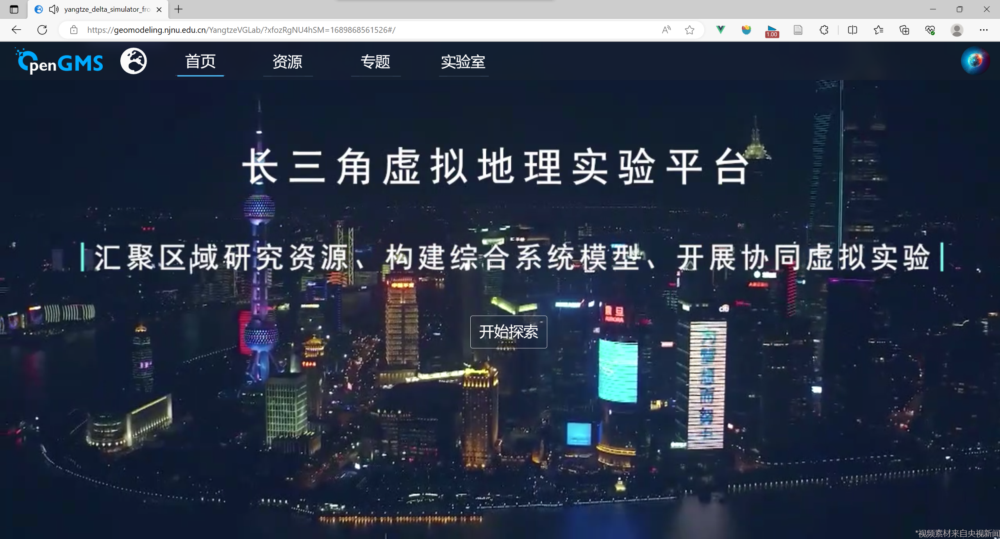

   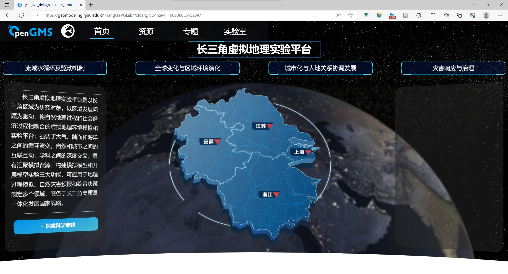

   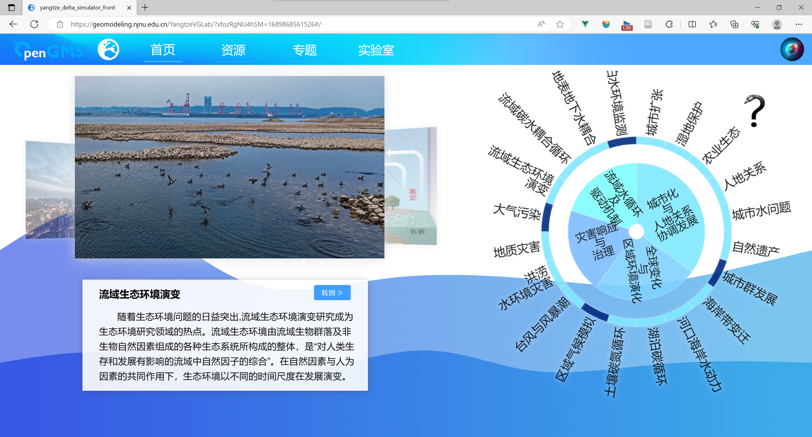

2. ##### 资源

   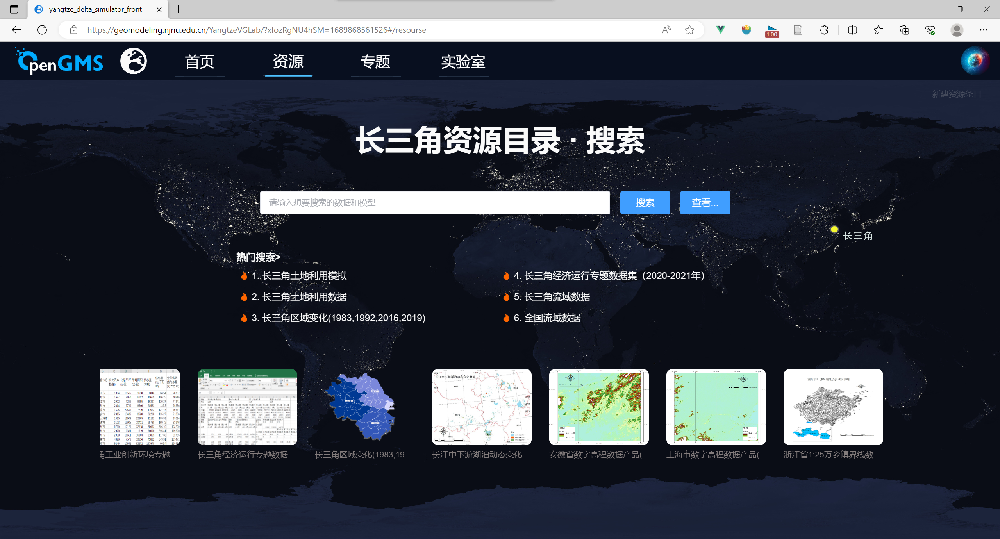

   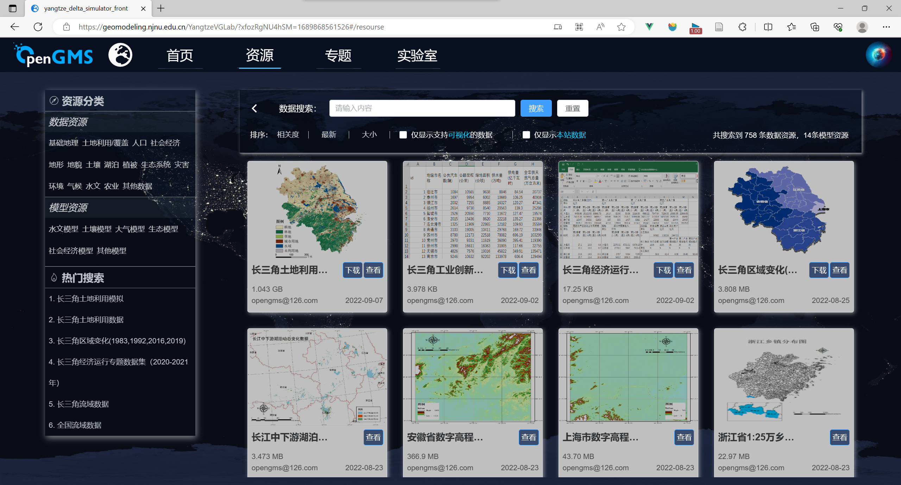

   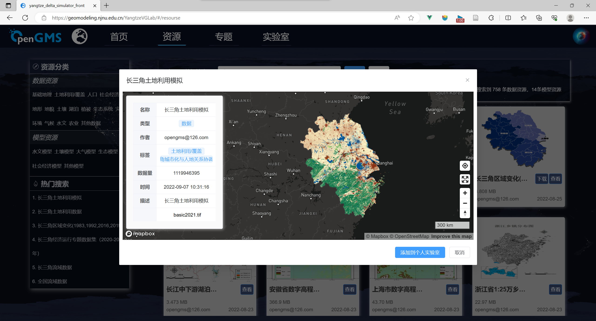

3. ##### 专题

   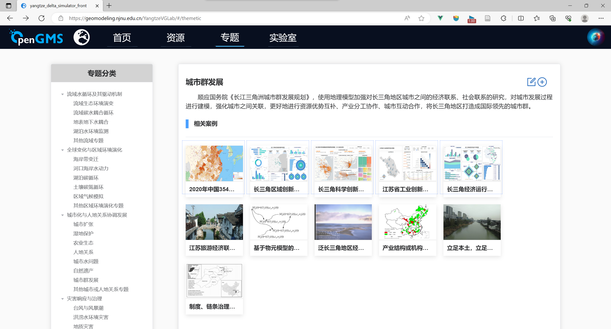

   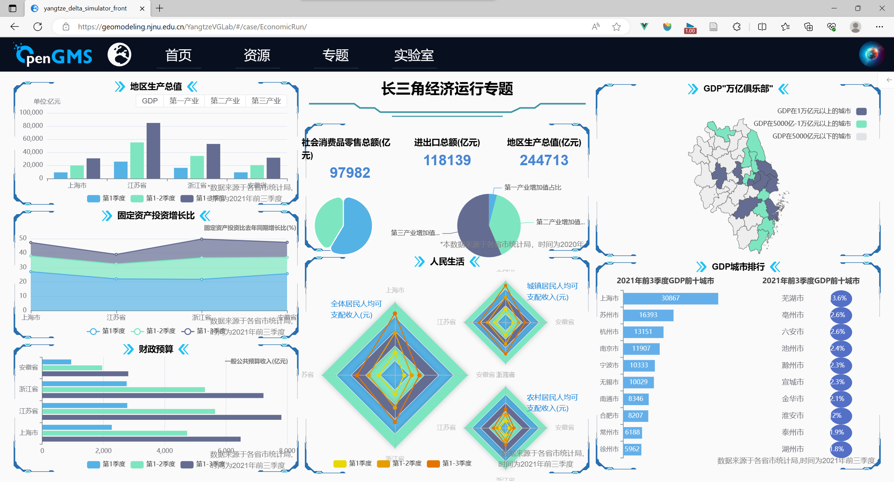

4. ##### 实验室

   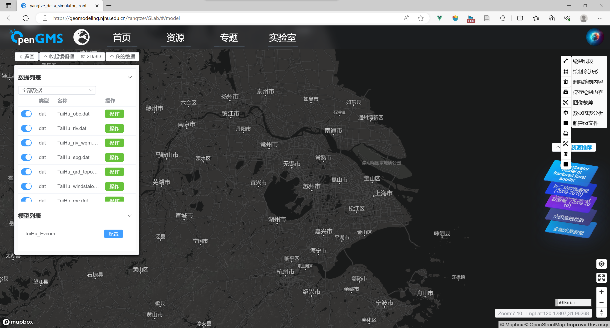

5. ##### 个人中心

   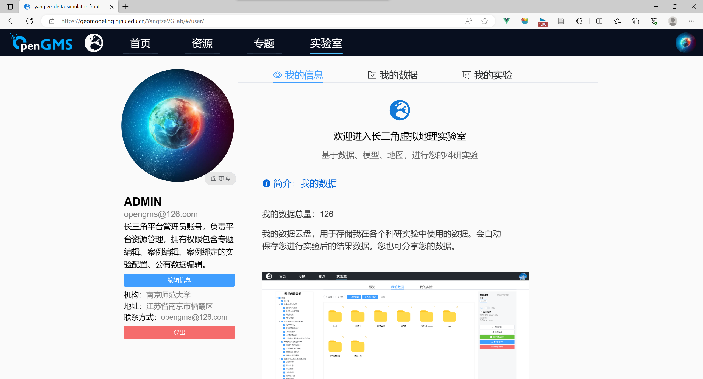

   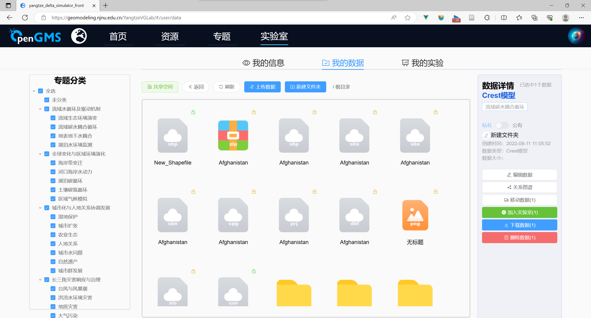

   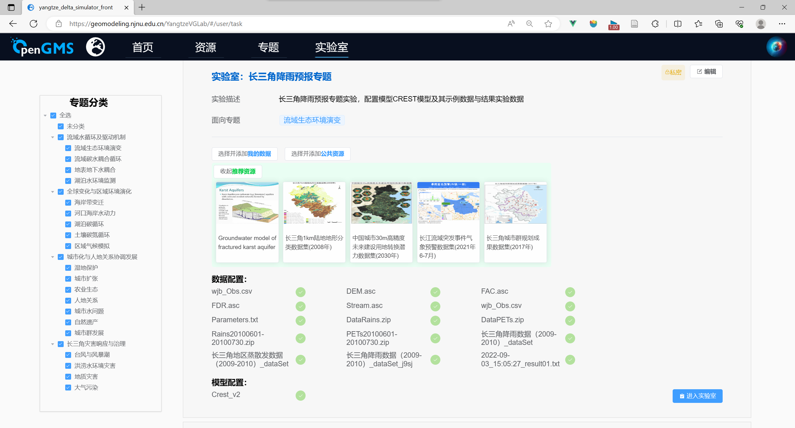